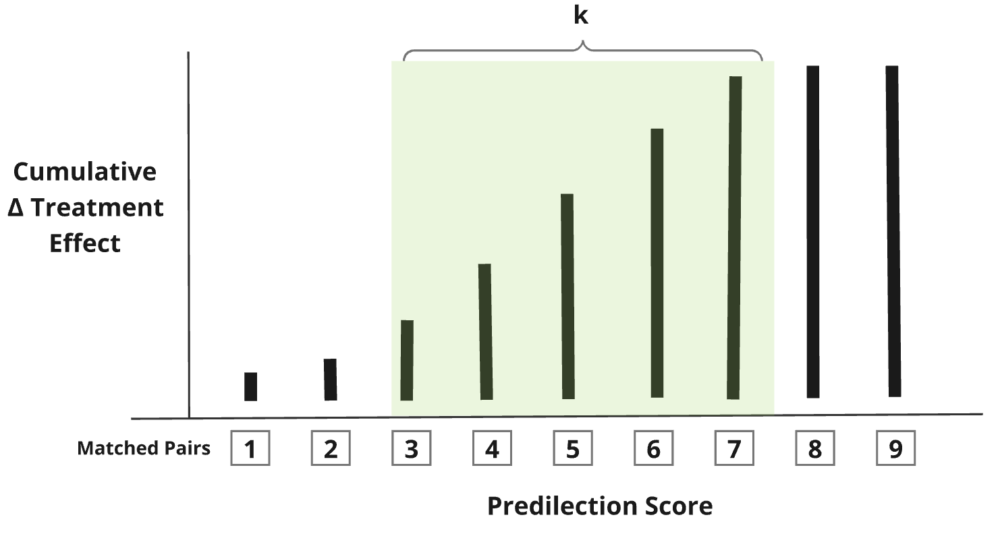

## Sweetspot Analysis

### Problem

Randomized controlled trials (RCTs) are a cornerstone of modern medical science. RCTs are typically performed with the goal of testing whether a treatment works for a given disease in a specific population of patients. They work by randomizing patients to a therapy of interests so that differences even out and outcomes only depends on whether they received treatment.

However, a core truth about medical care is that not all patients who receive a treatment will benefit equally from receiving it.

RCTs can be difficult and costly, so a preponderance of patients who may not benefit from the therapy may lead to a null finding, even if a treatment was beneficial. This leads to a proliferation of post-hoc analyses which can be arbitrary, controversial, and confusing.

#### Example

Consider a novel candidate drug called Statomycin which might be to prevent death in COVID-19. Suppose that the trial enrolls 10,000 patients with newly diagnosed COVID-19, half of whom are randomized to receive Statomycin.

However, we know that not all patients benefit equally from a given treatment. This is partly determined by the baseline disease severity, or how sick they are. In reality, despite careful inclusion criteria, patients will often fall on a spectrum of disease severity at the start of most clinical trial.

For COVID-19, some patients might only have a mild cough (green), while others may have severe pneumonia and be on death's door (red). Suppose Alice is a woman with a mild cough, and Bob is a man with severe pneumonia.

Alice will very likely going to survive her disease, while Bob will very likely to die from it, regardless of whether they receive Statomycin. In this respect, their outcomes will not necessarily inform us on whether Statomycin prevents death in COVID-19.

Conversely, patients further away from extremes of illness severity will experience a greater relative benefit from Statomycin. These patients can be said to fall in a **Sweetspot**—a Goldilocks zone—of patients whose outcome is more likely to be affected by the treatment.

### Sweetspot Concept

In essence, **Sweetspot Analysis** aims to identify the subset of patients in a randomized trial who were most likely to have benefited from a therapy, and calculates an **average treatment effect (ATE)** across those patients to determine whether the treatment was beneficial in those patients.

Example: Sweet Spot Present

Example: Sweet Spot Absent

## Methods

To find the Sweet Spot, the first step is to predict baseline illness severity of for each patient at the start of the trial, i.e. their risk of experiencing the outcome of interest if they did not receive the therapy of interest. This is the **Predeliction Score** for the outcome.

### Calculating Predilection Score

In clinical trials the baseline predilection for an outcome—or the risk of experiencing the outcome without treatment can only be known for the control group. However, the risk of the outcome before the trial begins is identical for both the treatment and control arms (I.I.D). This means that if we fit a model (e.g. logistic regression) to find the association between baseline covariates and the outcome of interest, the model describes the baseline risk for all patients (including the counter-factual where the treated group did not receive the treatment). Ergo, we can **directly calculate** baseline risk for the control group, and use our model covariates to **predict** the baseline predilection scores among the treatment group.

### Finding the Sweet Spot

To find the Sweet Spot, we will perform the following steps:

1)  Use predilection scores to **match** patients in the treatment and control groups

2)  Calculate **treatment effect**, which is the difference in outcome between the treated and control patients in each matched pair

3\) Calculate the average treatment effect for all matched pairs, and arrange them from lowest to highest predilection score

$$
\text{[Average Treatment Effect]} = \frac{\sum_{i=1}^{n}\text{[Treatment Effect]}_{i}}{n}
$$

4\) Calculate the cumulative distribution of treatment effect arranged by predilection score and **find the Sweet Spot** by iterating through each window to calculate the window size (k) which yields the largest value such that: sum(k\*average treatment effect)

$$
\text{Statistic}(k) =  \sum_{i=2+k}^{n}\text{[Treatment Effect in Window]} - k \cdot \text{[Average Treatment Effect]}
$$

The average treatment effect for pairs in the Sweet Spot provides the desired estimate of the effect of treatment on our outcome of interest.
