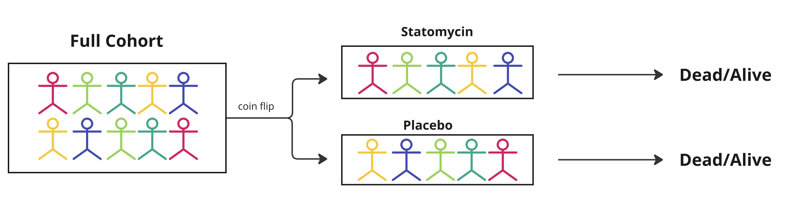
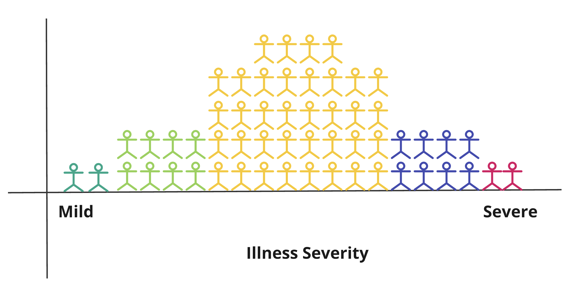
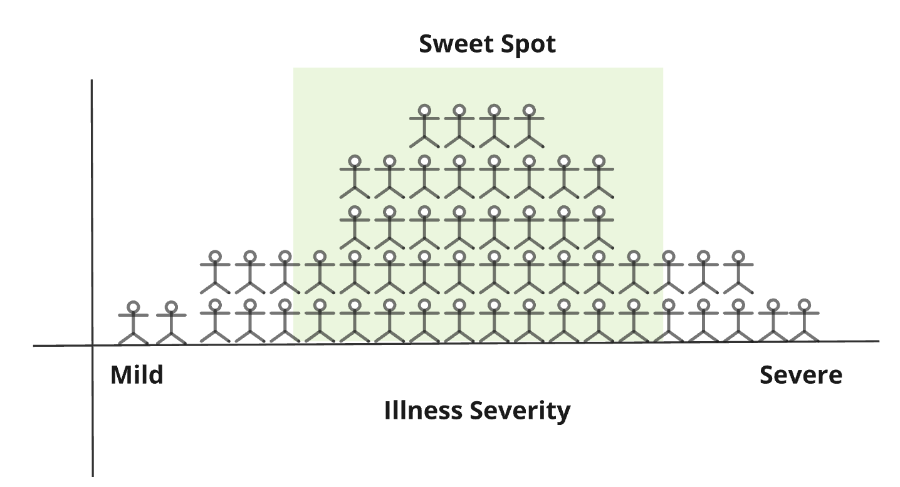
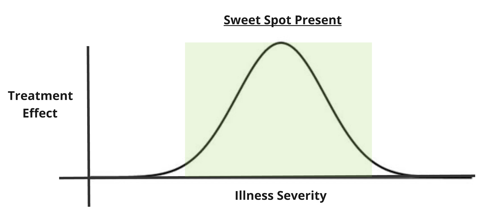
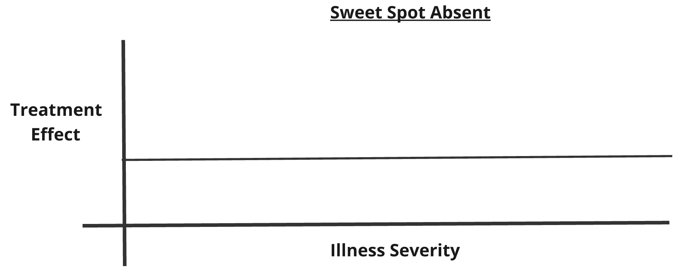
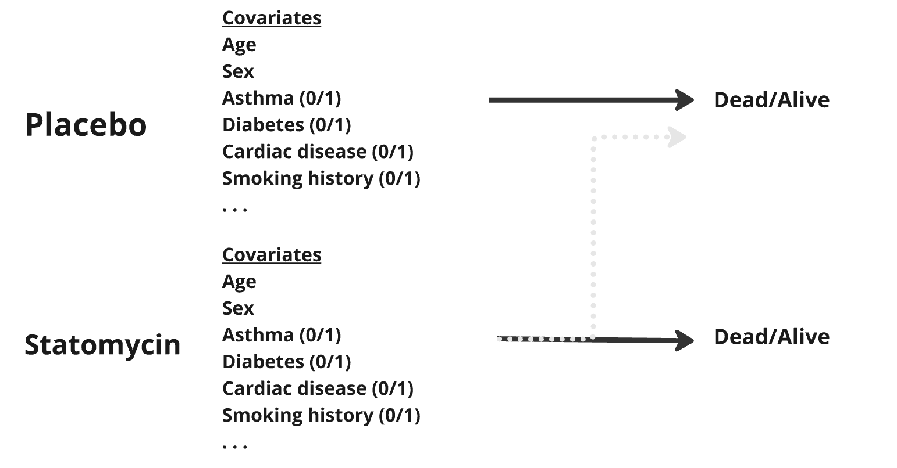
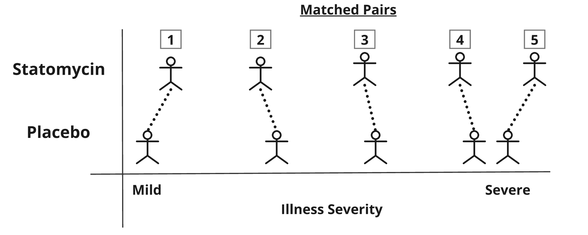
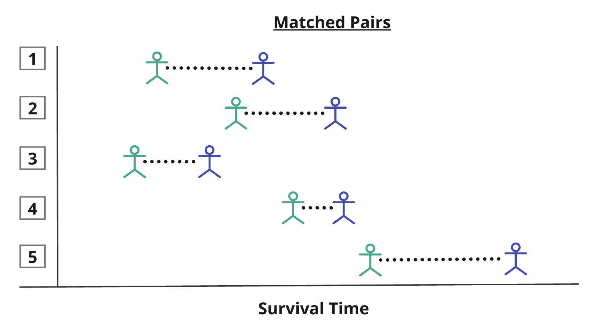
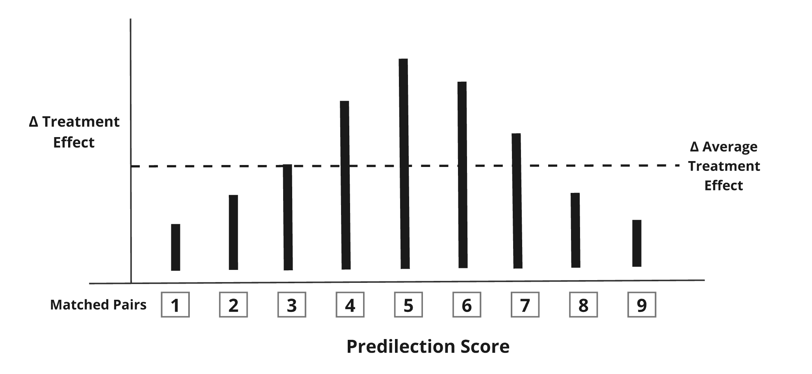
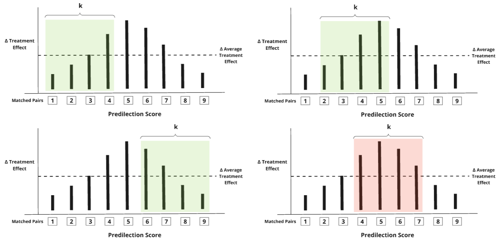

## Sweetspot Analysis

### Problem

Randomized controlled trials (RCTs) are a cornerstone of modern medical science. RCTs are typically performed with the goal of testing whether a treatment works for a given disease in a specific population of patients. They work by randomizing patients to a therapy of interests so that differences even out and outcomes only depends on whether they received treatment.

However, a core fact about medical therapies is that not all patients who receive a treatment will benefit equally from receiving it, also called heterogeneity of treatment effect.

RCTs can be difficult and costly, so a preponderance of patients who may not benefit from the therapy may lead to a null finding, even if a treatment was beneficial. This leads to a proliferation of post-hoc analyses which can be arbitrary, controversial, and confusing.

#### Example

Consider a novel candidate drug called Statomycin which might be to prevent death in COVID-19. Suppose that the Statomycin versus Placebo trial enrolls 10,000 patients with newly diagnosed COVID-19, half of whom are randomized to receive Statomycin.



However, we know that not all patients benefit equally from a receiving Statomycin therapy to prevent mortality. This is at least in part due to the baseline disease severity, or how sick they are. In reality, despite careful inclusion criteria, patients will often fall on a spectrum of disease severity at the start of most clinical trial.

For COVID-19, some patients might only manifest a mild cough (green), while others may develop severe pneumonia and be on death's door (red). Suppose Alice is a woman with a mild cough, and Bob is a man with severe pneumonia.



Alice will very likely going to survive her disease regardless of which trial arm she gets randomly assigned to, while Bob will very likely to die from it, also regardless of trial assignment. In this respect, their outcomes are unlikely to provide a large signal for whether Statomycin prevents death in COVID-19.

Conversely, patients further away from extremes of illness severity will experience a greater relative benefit from Statomycin. These patients can be said to fall in a **Sweetspot**—a Goldilocks zone—of patients whose outcome is more likely to be affected by the treatment.



### Sweetspot Concept

In essence, **Sweetspot Analysis** aims to identify the subset of patients in a randomized trial who were most likely to have benefited from a therapy, and calculates an **average treatment effect (ATE)** across those patients to determine whether the treatment was beneficial in those patients. Unlike traditional post-hoc analyses, Sweetspot Analysis can be readily automated, replicated, and involves very few investigator choices. This method was pioneered by Redelmeier et al and described at length in footnotes [1].

Example: Sweet Spot Present



Example: Sweet Spot Absent



## Methods

To find the Sweet Spot, the first step is to predict baseline illness severity of for each patient at the start of the trial, i.e. their risk of experiencing the outcome of interest if they did not receive the therapy of interest. This is the **Predilection Score** for the outcome.

### Calculating Predilection Score

In clinical trials the baseline predilection for an outcome—or the risk of experiencing the outcome without treatment can only be known for the control group. However, the risk of the outcome before the trial begins is identical for both the treatment and control arms (I.I.D). This means that if we fit a model (e.g. logistic regression) to find the association between baseline covariates and the outcome of interest, the model describes the baseline risk for all patients (including the counter-factual where the treated group did not receive the treatment). Ergo, we can **directly calculate** baseline risk for the control group, and use our model covariates to **predict** the baseline predilection scores among the treatment group (who, at the start of the group, can be considered I.I.D relative to the placebo group).



### Finding the Sweet Spot

To find the Sweet Spot, we will perform the following steps:

1)  Use the predicted predilection scores to **match** patients in the treatment and control groups



2)  Calculate the **treatment effect**, which is the difference in outcome between the treated and control patients in each matched pair



3\) Arrange the **treatement effect** from lowest to highest predilection score and additionally calculate the average treatment effect for all matched pairs

$$
\text{[Average Treatment Effect]} = \frac{\sum_{i=1}^{n_{matched_pairs}}\text{[Treatment Effect]}_{i}}{n}
$$



4)  **Find the Sweet Spot** by sliding over the arranged matched pair with a window of size $$k$$ and compute the sum of mean treatment effect within the window minus $$k*\text{[average treatment effect]}.$$ This procedure is done for each $$k \in \big[\min(4, \frac{1}{20} n), \frac{1}{2} n \big].$$ Next, we identify the $$k$$ with the highest deviation of the treatment effect from the global average treatment effect. Finally, the starting and ending index of the window with the maximum deviation are returned. Below we illustrate the procedure for a window of size $$k=4$$. After finishing the computation, we find that the patients with predilection score within the red region benefit the most from the treatment.

$$
\max_{k \in \big[\min(4, \frac{1}{20} n), \frac{1}{2} n\big]} \text{ Statistic}(k) \text{, where } \text{Statistic}(k) =  [\sum \text{Treatment Effect in Window]} - k \cdot \text{[Average Treatment Effect]}
$$



The average treatment effect for pairs in the Sweet Spot provides the desired estimate of the effect of treatment on our outcome of interest.

## Installation

To install and use the **sweetspot** package the following procedure needs to be followed:

```{r}
install.packages("devtools")
library(devtools)
devtools::install_github("MHelmann/sweetspot")
library(sweetspot)
```

## How To Run

The **sweetspot** repo provides several examples on how to perform the sweet spot analysis. One of the examples can be found in the [`tutorial.rmd`](tutorial.rmd) file. Further examples are also provided by executing `?sweetspot` in the console of RStudio.

Below an example is provided that uses data from a simulated study investigating the effects of a treatment, statomycin, on a binary outcome, survival from COVID-19.

```{r}
# Load the dataset 'binary_data' into the environment
data("binary_data")
# Extract the outcome variable (assumed to be the first column)
outcome <- binary_data[,1]
# Extract the treatment indicator variable (assumed to be the second column)
treated <- binary_data[,2]
# Extract the covariates (all remaining columns except the first and second)
cov <- binary_data[, -c(1, 2)]
# Remove column names from the covariates matrix
colnames(cov) <- NULL

# Run the 'sweetspot' function to identify treatment effect heterogeneity
result <- sweetspot(treated, cov, outcome, family = "binomial")
# Print and plot the findings
summary(result)
plot_sweetspot(result)
plot_quintiles(result)
```

Similarly, this analysis can also be run for a continuous response.

```{r}
# Simulate data with 1000 observations and 4 covariates  
datnorm <- sim_norm_sweetspot(1000, 4)
# Combine outcome, treatment, and covariates into one matrix  
continuous_data <- cbind(datnorm$outcome, datnorm$treated, datnorm$covariates)
# Add column names for clarity  
colnames(continuous_data) <- c("SBP Change", "Statomycin (Y/N)", "Age Z-score", "Physical Activity Score",  "Diabetes (Y/N)", "Dietary Score", "Air Quality Index", "CAD (Y/N)", "BMI Z-score", "Stress Score", "Sex (M/F)", "Happiness Score")

# Extract outcome variable (column 1)  
outcome <- continuous_data[,1]
# Extract treatment indicator (column 2)  
treated <- continuous_data[,2]
# Extract covariates (remaining columns)  
cov <- continuous_data[, -c(1, 2)]
# Remove column names from covariates  
colnames(cov) <- NULL

# Run the 'sweetspot' function to identify treatment effect heterogeneity
result <- sweetspot(treated, cov, outcome, family = "gaussian")
# Print and plot the findings
summary(result)
plot_sweetspot(result)
plot_quintiles(result)
```

## References

[1] [Redelmeier DA, Tibshirani RJ. An approach to explore for a sweet spot in randomized trials. *Journal of Clinical Epidemiology*. 2020;120:59-66. Available at: https://biolincc.nhlbi.nih.gov/publications/c02446c311a94c3b80f309104c50d85a/](https://biolincc.nhlbi.nih.gov/publications/c02446c311a94c3b80f309104c50d85a/)

## Acknowledgements

We would like to thank Don Redelmeier and Kennedy Ayoo for helpful comments. We would like to thank Erin Craig for writing the initial implementation of this method – we are grateful for the opportunity to build on it. And for the corresponding Arxiv pre-print that was highly informative for our package. [Craig E, Redelmeier DA, Tibshirani RJ. Finding and assessing treatment effect sweet spots in clinical trial data. *arXiv preprint arXiv:2011.10157*. 2020. Available at: https://arxiv.org/abs/2011.10157](https://arxiv.org/abs/2011.10157) Finally, we would like to thank our professor, Dr. Aya Mitani, for helping us through this journey.
